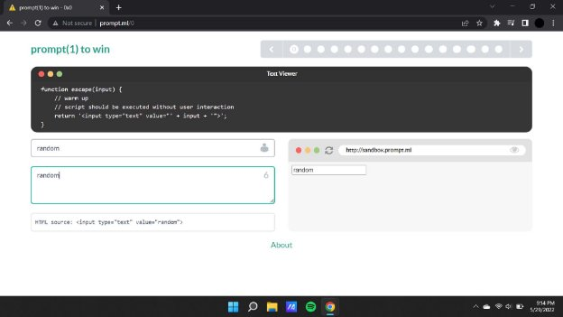

**Prompt.ml**

[**prompt(0) to win ](http://prompt.ml/)**Writeup:**

In the first level we see that we have been given the following screen with a text editor and a blank field where we can input the payload to alter the html source.

When we fiddle with the input area we see the html value also changes accordingly,

We have also been given a certain input parameter for the same which has to be added with the given payload.

**Payload : ">**

As soon as the above payload is inputted the web page opens up a pop up as shown below. Now we will continue by replacing alert with prompt.

**Payload : ">**

