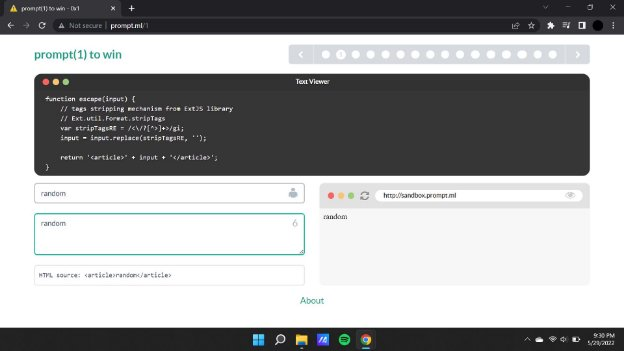
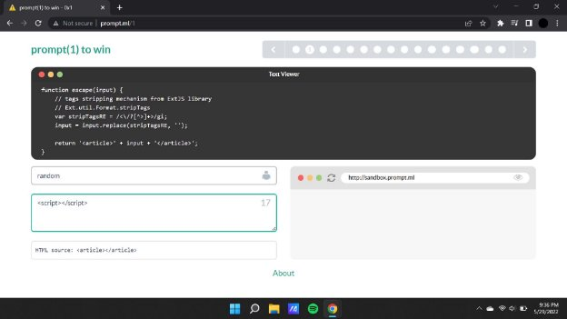
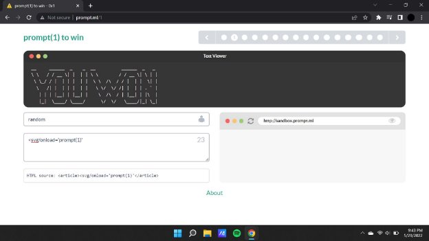

**Prompt.ml**

[**prompt(1) to win ](http://prompt.ml/)**Writeup:**

In the first level we see that we have been given the following screen with a text editor and a blank field where we can input the payload to alter the html source.

While fiddling with the html source code field we find that the values that are being inputted within the text area field are being placed between the article tag.

**Payload : **

But when script tags are being opened and closed within the text area the html source doesn't seem to reflect the changes.

This is when we introduce the svg tag xss payload with the attribute onload to apply the changes onto the webpage.

**Payload : <svg/onload='prompt(1)'**

Similar to the previous challenge we have to consider he ‘ ’ in the payload to acquire the following output

