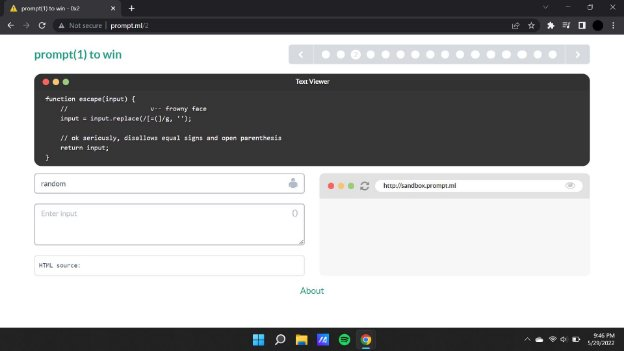
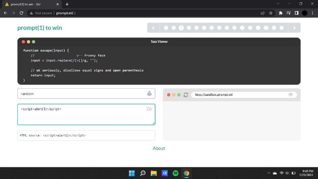
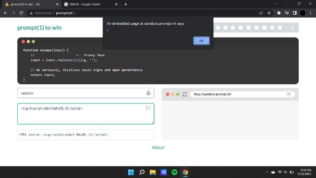

**Prompt.ml**

[**prompt(2) to win ](http://prompt.ml/)**Writeup:**

In the first level we see that we have been given the following screen with a text editor and a blank field where we can input the payload to alter the html source.

When we input a very basic xss payload we see that the html source does not tend to reflect the ( bracket.

**Payload : **

We will replace the ( with the html hex entity reference which is “ &#x28; ” , thereby altering the payload.

**Payload : **

Now for the following payload to run we will have to add the <svg>  tag

Now replacing prompt with alert.
