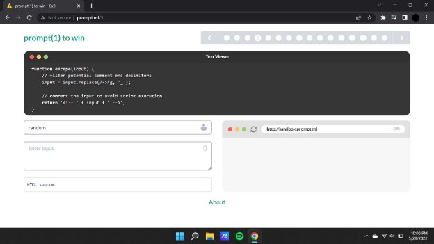
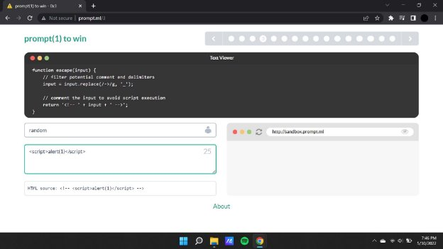
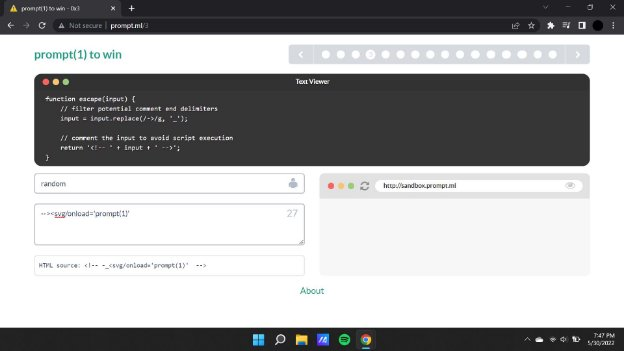
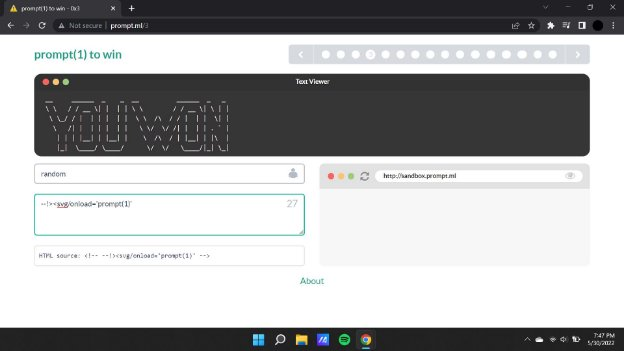

**Prompt.ml**

[**prompt(3) to win ](http://prompt.ml/)**Writeup:**

In the first level we see that we have been given the following screen with a text editor and a blank field where we can input the payload to alter the html source.

In this challenge we are given a certain set of parameters that are to be met in order to surpass the html source.

On running a basic xss payload we see that there are no specific changes in the text box output As it is being inserted within the comment tag and thereby not reflecting any changes.

**Payload : **

**Payload : <svg/onload='prompt(1)'**

We continue by altering and changing the payload with the parameters that are given to us in the text viewer field.

**Payload : --><svg/onload='prompt(1)'**

Here now we will be using the closing comment tag or simply “ —!>” to escape out of it (the comment section of the payload) and then u can continue with the construction of the xss payload.

**Payload : --!><svg/onload='prompt(1)'**

