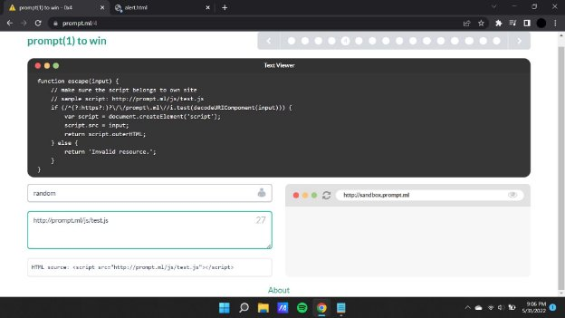

**Prompt.ml**

[**prompt(4) to win ](http://prompt.ml/)**Writeup:**

In the first level we see that we have been given the following screen with a text editor and a blank field where we can input the payload to alter the html source.

Similar to the previous challenges we can see that there are a certain set of defined parameters that are to be followed while constructing the payload.

When we enter any common xss payload such as alert or svg/onload.The html source gives us an invalid resource output like so:

**Payload : **

**Payload : <svg/onload='prompt(1)'**

On going through the parameters that are set in the text viewer box we see that it takes only one type of input that is in a url format.

**Payload : http://prompt.ml/js/test.js**

From this we understand that the payload will only be accepted if it is inputted via the src (source) attribute of the script tag for which we will have to create our very own basic html code which when run will give us an output as a popup or alert.

When we open the file that we have created on a web browser application we are greeted with a popup message.

